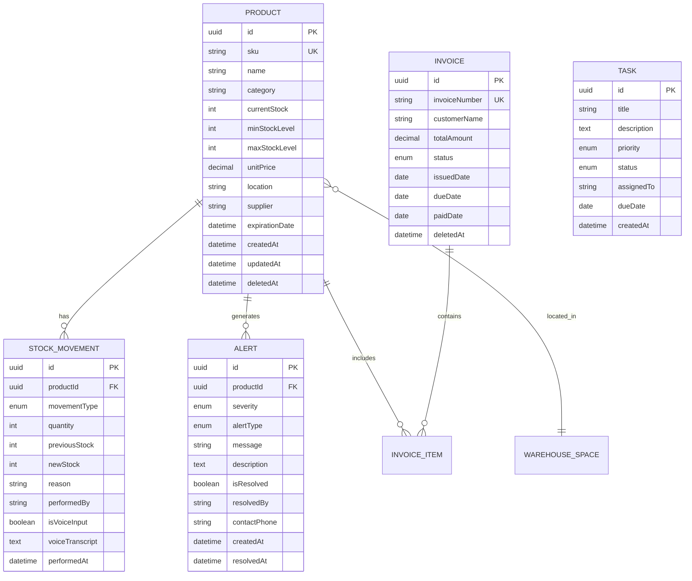

<div align="center">

# 📦 Easy Stock

### Sistema Inteligente de Gestión de Almacén

[](https://github.com/brunodpl/easy_stock)
[](LICENSE)
[](#roadmap)
[](package.json)
[](https://www.postgresql.org/)

**Sistema de gestión de inventario para PyMEs con IA, accesibilidad avanzada y automatización inteligente**

[Características](#-características-principales) • [Arquitectura](#-arquitectura-del-sistema) • [Stack Tecnológico](#-stack-tecnológico) • [Instalación](#-instalación-rápida) • [API](#-api-rest) • [Roadmap](#-roadmap)

</div>

---
## 🎯 Objetivo del Proyecto

Easy Stock nace para simplificar al máximo el trabajo del responsable de almacén.  
El sistema actúa como un microservicio de análisis de inventario que ofrece un panel único y muy visual donde se ve, de un vistazo, el estado real del stock.

El dashboard muestra:
- 💰 **Coste total del inventario** y número total de productos
- 📦 **Listado de productos** con fecha de caducidad, ID, nombre, unidades, zona, etc.
- 🏭 **Capacidad total del almacén** y porcentaje actualmente ocupado
- 💳 **Facturas próximas y vencidas**
- 🚨 **Alertas generadas automáticamente** en función de productos, facturas y capacidad usada

El valor principal está en:
- Un **estado global del stock** codificado por colores (🟥 rojo, 🟨 amarillo, 🟩 verde)
- Un **sistema de alertas inteligente** que prioriza qué atender primero

Nuestro foco es seguir refinando:
- ⚡ La **velocidad** de la aplicación (carga, consultas, renderizado)
- 🤖 La **automatización** de cálculos, detección de riesgos y tareas repetitivas
- 📊 La **calidad de los datos**, asegurando información fiable y consistente

El objetivo final: un dashboard sencillo pero extremadamente útil y eficiente, que permita tomar decisiones rápidas sin perder tiempo navegando múltiples sistemas.
## 🎯 Características Principales

<table>
<tr>
<td width="50%">

### ✅ **Implementado**

- 📊 **Dashboard Interactivo** con 12 KPIs en tiempo real
- 🔔 **Sistema de Alertas** inteligente (4 niveles de severidad)
- 📦 **Gestión de Inventario** completa con tracking de movimientos
- 💰 **Control de Facturas** con soft delete y estados múltiples
- ✅ **Gestión de Tareas** con priorización visual
- 📱 **PWA Ready** - Instalable como app nativa
- 🌓 **Modo Claro/Oscuro** automático
- 🔒 **Headers de Seguridad** (XSS, Clickjacking, MIME sniffing)
- ⚡ **Optimizado** - Solo 62KB de aplicación
- 🎨 **Diseño Responsivo** mobile-first

</td>
<td width="50%">

### 🚧 **En Roadmap**

- 🎤 **Control por Voz** (Web Speech API + Whisper)
- 🤖 **Procesamiento CSV con LLM** para resolución de inconsistencias
- 📈 **Machine Learning** para predicción de demanda
- 📱 **Notificaciones Push** en tiempo real
- 📄 **Reportes PDF/Excel** exportables
- 📞 **Contactos de Emergencia** con escalamiento automático
- 🔄 **Sincronización Offline** para PWA
- 🌐 **Multilenguaje** (i18n)

</td>
</tr>
</table>

---

## 🏗 Arquitectura del Sistema

```
┌─────────────────────────────────────────────────────────────────┐
│                    CAPA DE PRESENTACIÓN                         │
│  ┌──────────────┐  ┌──────────────┐  ┌──────────────┐         │
│  │   HTML5      │  │   CSS3       │  │  Vanilla JS  │         │
│  │  Semántico   │  │  Tokens      │  │    ES6+      │         │
│  └──────────────┘  └──────────────┘  └──────────────┘         │
│         PWA + Responsive Design + Design System                │
└─────────────────────────────────────────────────────────────────┘
                              ▼
┌─────────────────────────────────────────────────────────────────┐
│                    CAPA DE APLICACIÓN                           │
│  ┌──────────────────────────────────────────────────────────┐  │
│  │              Express.js REST API (11 endpoints)          │  │
│  │   GET /api/products  │  POST /api/products              │  │
│  │   GET /api/alerts    │  PUT /api/products/:id           │  │
│  │   GET /api/kpis      │  PUT /api/products/:id/stock     │  │
│  │   GET /api/invoices  │  DELETE /api/products/:id        │  │
│  │   GET /api/tasks     │  DELETE /api/invoices/:id        │  │
│  └──────────────────────────────────────────────────────────┘  │
│     Validación UUID | Transacciones Atómicas | Soft Delete     │
└─────────────────────────────────────────────────────────────────┘
                              ▼
┌─────────────────────────────────────────────────────────────────┐
│                   CAPA DE LÓGICA DE NEGOCIO                     │
│  ┌──────────────────────────────────────────────────────────┐  │
│  │                  Prisma ORM v6.19.0                      │  │
│  │    Type-safe queries | Migraciones | Transacciones      │  │
│  └──────────────────────────────────────────────────────────┘  │
└─────────────────────────────────────────────────────────────────┘
                              ▼
┌─────────────────────────────────────────────────────────────────┐
│                      CAPA DE DATOS                              │
│  ┌──────────────────────────────────────────────────────────┐  │
│  │                   PostgreSQL 15+                         │  │
│  │  Product | StockMovement | Alert | Invoice | Task       │  │
│  │  InvoiceItem | WarehouseSpace | DataInconsistency       │  │
│  └──────────────────────────────────────────────────────────┘  │
│     Índices Estratégicos | ACID | Soft Delete | Timestamps     │
└─────────────────────────────────────────────────────────────────┘
```

---

## 💻 Stack Tecnológico

<div align="center">

### Frontend


### Backend


### Base de Datos


### Herramientas


</div>

### Dependencias Principales

```json
{
  "dependencies": {
    "@prisma/client": "^6.19.0",
    "express": "^4.18.2",
    "pg": "^8.16.3"
  },
  "devDependencies": {
    "prisma": "^6.19.0",
    "typescript": "^5.9.3",
    "ts-node": "^10.9.2"
  }
}
```

---

## 📊 Dashboard y KPIs

### Indicadores Clave de Rendimiento (12 KPIs en Tiempo Real)

<table>
<tr>
<td width="33%">

#### 📦 **Inventario**
- Total de productos
- SKUs únicos
- Valor total del inventario
- Valor promedio por SKU

</td>
<td width="33%">

#### 🔔 **Alertas**
- Alertas activas totales
- Por severidad:
  - 🔴 Críticas
  - 🟠 Atención
  - 🟡 Leves
  - 🔵 Informativas

</td>
<td width="33%">

#### 📈 **Estado del Almacén**
- Stock crítico
- Stock bajo
- Productos caducados
- Caducidad inminente
- % Espacio ocupado
- Puntuación de salud (0-100)

</td>
</tr>
</table>

### Consultas SQL Optimizadas

```sql
-- Total de productos
SUM(current_stock)

-- Valor total del inventario
SUM(current_stock * unit_price)

-- Alertas críticas activas
COUNT(*) WHERE alert_type = 'critica' AND resolved = false

-- Stock crítico
COUNT(*) WHERE current_stock <= min_stock * 0.5

-- % Espacio ocupado
(SUM(current_stock) / capacidad_maxima) * 100
```

---

## 🗄️ Modelo de Base de Datos

### Esquema Propuesto (7 Modelos)



### Tipos Enum

| Modelo | Campo | Valores |
|--------|-------|---------|
| **StockMovement** | movementType | `IN`, `OUT`, `ADJUSTMENT`, `RETURN` |
| **Alert** | severity | `CRITICAL`, `WARNING`, `INFO`, `NOTICE` |
| **Alert** | alertType | `LOW_STOCK`, `OUT_OF_STOCK`, `OVERSTOCK`, `EXPIRING_SOON`, `DATA_INCONSISTENCY`, `SYSTEM` |
| **Invoice** | status | `PENDING`, `PAID`, `OVERDUE`, `CANCELLED` |
| **Task** | priority | `URGENT`, `HIGH`, `MEDIUM`, `LOW` |
| **Task** | status | `PENDING`, `IN_PROGRESS`, `COMPLETED`, `CANCELLED` |

---

## 🚀 API REST

### Endpoints Disponibles

#### 📦 Productos

```http
GET    /api/products          # Obtener todos los productos
POST   /api/products          # Crear nuevo producto
PUT    /api/products/:id      # Actualizar producto
PUT    /api/products/:id/stock # Actualizar solo stock
DELETE /api/products/:id      # Soft delete producto
```

#### 🔔 Alertas

```http
GET    /api/alerts            # Obtener alertas activas
```

#### 📊 KPIs

```http
GET    /api/kpis              # Obtener todos los KPIs del dashboard
```

#### 💰 Facturas

```http
GET    /api/invoices          # Facturas próxima semana
DELETE /api/invoices/:id      # Soft delete factura
```

#### ✅ Tareas

```http
GET    /api/tasks             # Obtener todas las tareas
DELETE /api/tasks/:id         # Eliminar tarea
```

### Ejemplo de Respuesta: KPIs

```json
{
  "inventory": {
    "totalProducts": 15420,
    "uniqueSKUs": 342,
    "totalValue": 458920.50,
    "averageValue": 1342.16
  },
  "alerts": {
    "total": 23,
    "critical": 5,
    "warning": 12,
    "info": 4,
    "notice": 2
  },
  "stock": {
    "critical": 8,
    "low": 15,
    "overstock": 3
  },
  "warehouse": {
    "spaceOccupied": 78.5,
    "healthScore": 85
  }
}
```

---

## ⚡ Optimizaciones de Rendimiento

### Frontend

| Optimización | Antes | Después | Mejora |
|--------------|-------|---------|--------|
| **Favicon** | 5-10KB (ICO) | 100 bytes (SVG) | **98%** |
| **Fuentes** | 40-80KB externas | 0KB (system fonts) | **100%** |
| **Framework** | 40-100KB (React/Vue) | 0KB (Vanilla JS) | **100%** |
| **Tamaño total** | ~150KB | **62KB** | **59%** |

### Backend

- ✅ **Cache Headers**: 1 día para assets estáticos
- ✅ **Compresión Gzip**: Habilitada
- ✅ **Connection Pooling**: Prisma optimizado
- ✅ **Índices Estratégicos**: En columnas frecuentes
- ✅ **Transacciones**: Operaciones atómicas

### Seguridad

```javascript
// Headers implementados
app.use((req, res, next) => {
  res.setHeader('X-Content-Type-Options', 'nosniff');
  res.setHeader('X-Frame-Options', 'DENY');
  res.setHeader('X-XSS-Protection', '1; mode=block');
  next();
});
```

---

## 🔧 Instalación Rápida

### Prerequisitos

- Node.js >= 18.0.0
- PostgreSQL >= 15
- npm o yarn

### Pasos

```bash
# 1. Clonar repositorio
git clone https://github.com/brunodpl/easy_stock.git
cd easy_stock

# 2. Instalar dependencias
npm install

# 3. Configurar variables de entorno
cp .env.example .env
# Editar .env con credenciales de PostgreSQL

# 4. Ejecutar migraciones de Prisma
npx prisma migrate dev

# 5. (Opcional) Poblar con datos de prueba
npx prisma db seed

# 6. Iniciar servidor
npm start
```

El servidor estará disponible en `http://localhost:3001`

---

## 🎯 Roadmap

### Q1 2026 - Fase 1: Automatización IA

- [ ] **Control por Voz**
  - Integración Web Speech API
  - Whisper API para transcripción precisa
  - Campos `isVoiceInput` y `voiceTranscript` en DB
  - Costo estimado: $6/1000 interacciones

- [ ] **Procesamiento CSV con LLM**
  - Detección automática de inconsistencias
  - Resolución inteligente con revisión humana
  - Modelo `DataInconsistency` para logging

### Q2 2026 - Fase 2: Inteligencia Predictiva

- [ ] **Machine Learning**
  - Forecasting de demanda
  - Detección de anomalías
  - Optimización de rutas de picking
  - Requiere 6-12 meses de datos históricos

- [ ] **Reportes Avanzados**
  - Exportación PDF/Excel
  - Visualizaciones con Chart.js
  - Análisis personalizables

### Q3 2026 - Fase 3: Escalabilidad

- [ ] **Arquitectura Distribuida**
  - Connection pooling con PgBouncer
  - Particionamiento de tablas
  - Réplicas streaming

- [ ] **Notificaciones Push**
  - Web Push API
  - Alertas en tiempo real
  - Configuración granular por usuario

### Q4 2026 - Fase 4: Características Premium

- [ ] **Gestión Avanzada de Tareas**
  - Escalamiento automático
  - Visualización de dependencias
  - Asignación inteligente

- [ ] **Contactos de Emergencia**
  - Notificaciones a supervisores
  - Jerarquías de escalamiento
  - Integración telefónica

---

## 📚 Mejores Prácticas Implementadas

### Patrón Singleton (Prisma Client)

```typescript
// lib/prisma.ts
const prisma = globalForPrisma.prisma ?? new PrismaClient({
  log: process.env.NODE_ENV === 'development' 
    ? ['query', 'error', 'warn'] 
    : ['error'],
});
```

### Transacciones Atómicas

```javascript
// Movimiento de stock con alertas
return prisma.$transaction(async (tx) => {
  const product = await tx.product.update({
    where: { id },
    data: { currentStock: newStock }
  });
  
  await tx.stockMovement.create({
    data: { productId: id, quantity, movementType: 'OUT' }
  });
  
  if (newStock <= product.minStockLevel) {
    await tx.alert.create({
      data: { 
        productId: id, 
        severity: 'CRITICAL',
        alertType: 'LOW_STOCK'
      }
    });
  }
});
```

### Soft Delete

```javascript
// Preservar historial con soft delete
await prisma.product.update({
  where: { id },
  data: { deletedAt: new Date() }
});

// Excluir en consultas
const products = await prisma.product.findMany({
  where: { deletedAt: null }
});
```

### Validación Multinivel

```javascript
function buildProductUpdateData(body) {
  const errors = [];
  
  // Validar campos requeridos
  if (!body.name || !body.sku || !body.category) {
    errors.push('Campos requeridos faltantes');
  }
  
  // Validar lógica de negocio
  if (body.minStock && body.maxStock && body.minStock > body.maxStock) {
    errors.push('minStock no puede ser mayor que maxStock');
  }
  
  if (errors.length > 0) {
    throw new ValidationError('Validación fallida', errors);
  }
  
  return validatedData;
}
```

---

## 👨‍💻 Autor

**Bruno Del Palacio Rodríguez**

[](https://github.com/brunodpl)
[](https://linkedin.com/in/brunodpl)

---

## 📄 Licencia

Este proyecto está licenciado bajo la Licencia ISC - ver el archivo [LICENSE](LICENSE) para más detalles.

---

## 🙏 Agradecimientos

- Inspiración de diseño: [Perplexity Design System](https://www.perplexity.ai)
- ORM: [Prisma](https://www.prisma.io)
- Base de datos: [PostgreSQL](https://www.postgresql.org)

---

<div align="center">

**⭐ Si este proyecto te resulta útil, considera darle una estrella ⭐**

[Reportar Bug](https://github.com/brunodpl/easy_stock/issues) • [Solicitar Feature](https://github.com/brunodpl/easy_stock/issues) • [Contribuir](CONTRIBUTING.md)

</div>
